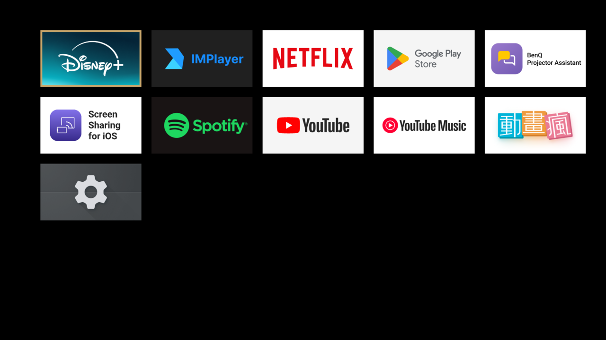

# just-a-launcher

最小 Android TV launcher：一個 GridView 列出所有 TV app（LEANBACK_LAUNCHER），沒有動畫、桌布、
推薦列、常駐服務。常駐記憶體約 35MB（Google TV 首頁 193MB、Projectivy 80MB）。

原本是給 BenQ GV01 投影機（Android TV 14、2GB RAM）做的，任何 Android TV / Google TV 都能用。



## 為什麼

測試機：BenQ GV01 投影機（MediaTek MT9632，4 核 A55 1.55GHz，2GB RAM，Android TV 14）。
停在首頁、焦點在 app 格子、遙控器不碰，每分鐘取樣一次連續 9 分鐘，數字全程沒有浮動：

| 閒置 | Google TV 首頁 | Google TV 僅限應用程式模式 | Projectivy Launcher* | just-a-launcher |
|---|---|---|---|---|
| 常駐 RAM（PSS，含副程序） | 193MB | 136MB | 80MB + 27MB zram | 35MB |
| 首頁程序 CPU（佔一核） | 48% | 40% | 2.6% | 0% |
| 畫面合成 surfaceflinger（佔一核） | 33% | 32% | ~0 | 0% |
| **全機 CPU（四核）** | **39%** | **38%** | ~15% | **10%** |
| 每秒重畫 | 61 | 61 | 0 | 0 |
| 廣告 | 有 | 頂部整頁輪播還在 | 無 | 無 |

\* Projectivy 為單次取樣，已在其設定中關掉動態桌布和聚焦動畫；預設設定下每秒重畫 60 次。

Google TV 首頁閒置時聚焦光圈每秒重畫 61 次，首頁加畫面合成佔掉 0.8 核，整台機器閒置就有四成在忙。
遙控器按鍵、影片解碼都跟它搶，這是「慢」的主因。「僅限應用程式模式」（設定 → 帳戶與登入 → 帳戶）
拿掉推薦列和預覽影片，省了 57MB，但頂部輪播廣告還在、光圈照樣重畫，CPU 幾乎沒變。

RAM 的影響是非線性的。2GB 的裝置扣掉系統後可用的只有三、四百 MB，首頁少佔 160MB，
Netflix、YouTube 就能同時留在記憶體，切換 1 秒而不是被殺掉後冷啟動 10 秒。
同樣的 160MB 在 8GB 的電視上幾乎沒感覺。

量法（`dumpsys cpuinfo` 每個程序的 % 是佔一核，只有 TOTAL 是佔全部核心）：

```
adb shell dumpsys cpuinfo | head                                    # 誰在吃 CPU
adb shell dumpsys gfxinfo <套件> | grep 'Total frames'              # 隔 60 秒量兩次取差 = 重畫次數
adb shell dumpsys meminfo <套件> | grep 'TOTAL PSS'
```

## 需求

- Android TV / Google TV，Android 5.0 以上。不符的裝置（手機、平板、太舊的電視）安裝時會直接被拒
- 電腦上有 adb，電視開啟開發人員選項 → USB / 網路偵錯
- 電腦和電視連同一個 Wi-Fi / 區網（訪客網路通常會隔離裝置，不行）

想先確認再裝：電視「設定 → 關於 → Android 版本」5.0 以上即可。或用 adb：

```
adb shell getprop ro.build.version.sdk      # ≥ 21
adb shell pm list features | grep leanback  # 有輸出才是 Android TV
```

## 安裝

APK 在 [Releases](https://github.com/hungmi/just-a-launcher/releases/latest)，固定網址
`https://github.com/hungmi/just-a-launcher/releases/latest/download/just-a-launcher.apk`。

1. 連線
   ```
   adb connect <電視 IP>
   ```
2. 記下原本的首頁，還原要用
   ```
   adb shell cmd package query-activities --brief -a android.intent.action.MAIN -c android.intent.category.HOME
   ```
3. 安裝、設為首頁。電視沒有「選預設首頁」的 UI，一定要用第二行那個指令
   ```
   adb install -r just-a-launcher.apk
   adb shell cmd package set-home-activity --user 0 tw.hungmi.justalauncher/.MainActivity
   ```
4. 確認
   ```
   adb shell cmd package resolve-activity --brief -a android.intent.action.MAIN -c android.intent.category.HOME
   ```
   印出 `tw.hungmi.justalauncher/.MainActivity` → **完成**，按 HOME 就是新首頁，下面不用做。
   印出別的 → 繼續。Google TV 機型（BenQ GV01、小米盒子 S 2 代、Chromecast with Google TV…）
   一定會印 `com.google.android.apps.tv.launcherx/...`，set-home-activity 對它沒用。
5. 停用原本的首頁。**兩個都要停**：只停第一個，HOME 會被設定精靈（setupwraith）攔成黑畫面，
   看起來像遙控器壞了。每停一個 adb 會斷線，重連
   ```
   adb shell pm disable-user --user 0 com.google.android.apps.tv.launcherx
   adb connect <電視 IP>
   adb shell pm disable-user --user 0 com.google.android.tungsten.setupwraith
   adb connect <電視 IP>
   ```
6. 再跑一次第 4 步的指令，印出 `tw.hungmi.justalauncher/.MainActivity` 就完成。

做了第 5 步的副作用：之後要**新增 Google 帳號**或 Play 商店要求重新登入時，先
`adb shell pm enable --user 0 com.google.android.tungsten.setupwraith`，弄完再停用。

第 2 步列出的不是 Google TV 的話沒測過。第 4 步不過就把第 5 步的套件換成第 2 步列出的那個。

## 讓 AI agent 幫你裝

不想自己打指令，把下面整段貼給 Claude Code 之類能跑終端機的 agent。
它會自己找電視 IP：找得到一台就直接用，找到多台或找不到才問你。

<details>
<summary>中文 prompt</summary>

```
請幫我把 just-a-launcher（https://github.com/hungmi/just-a-launcher）裝到我的 Android TV 並設為首頁。
指令你自己執行，每一步用白話說明你在做什麼。

規則
1. 只能用 adb install、cmd package set-home-activity，以及對下面第 7 步指定的兩個套件
   pm disable-user。不要 pm uninstall、不要停用其他東西、不要 root。
2. 先確認 adb 已安裝，沒有就依我的作業系統裝：macOS `brew install android-platform-tools`、
   Debian/Ubuntu `apt install adb`、Arch `pacman -S android-tools`、Windows 下載 Google platform-tools。
3. 找電視 IP，照這個順序。確定就直接用，不確定就列選項問我：
   前提：電腦和電視要在同一個 Wi-Fi / 區網，先提醒我確認（訪客網路會隔離裝置）。
   a. `adb devices` 已經有裝置 → 直接用。
   b. 掃區網哪台開著 5555 port（Android TV 的網路偵錯）。Linux/macOS 範例：
        net=$(ip -4 route get 1 | awk '{print $7}' | cut -d. -f1-3)   # macOS：ipconfig getifaddr en0
        for i in $(seq 1 254); do (timeout 0.3 bash -c "</dev/tcp/$net.$i/5555" 2>/dev/null && echo $net.$i) & done; wait
      只找到一台 → 就是它。
   c. 沒有或多台 → 用 mDNS 列出區網的 Android TV：
        Linux `avahi-browse -rtp _androidtvremote2._tcp`、macOS `dns-sd -B _androidtvremote2._tcp local.`
      把裝置名稱和 IP 列給我選。找不到 5555 的話，提醒我在那台電視開啟：
      設定 → 系統 → 關於 → 版本號連按 7 下 → 開發人員選項 → 網路偵錯（或 USB 偵錯）。
   d. 都找不到 → 請我到電視「設定 → 網路 → 狀態」看 IP。
4. 安裝：
        adb connect <IP>:5555        # 電視會跳「允許偵錯？」，提醒我在電視按允許
        curl -LO https://github.com/hungmi/just-a-launcher/releases/latest/download/just-a-launcher.apk
        adb install -r just-a-launcher.apk
   若出現 INSTALL_FAILED_OLDER_SDK 或 INSTALL_FAILED_MISSING_FEATURE，代表這台不支援，
   停下來告訴我，不要想辦法繞過。
5. 記下原本的首頁，最後還原指令要用：
        adb shell cmd package query-activities --brief -a android.intent.action.MAIN -c android.intent.category.HOME
6. 設為首頁，然後確認：
        adb shell cmd package set-home-activity --user 0 tw.hungmi.justalauncher/.MainActivity
        adb shell cmd package resolve-activity --brief -a android.intent.action.MAIN -c android.intent.category.HOME
   印出 tw.hungmi.justalauncher/.MainActivity → 跳到第 8 步。印出別的 → 第 7 步。
7. 停用原本的首頁。只在第 5 步清單有 com.google.android.apps.tv.launcherx（Google TV 機型）時做，
   其他機型停下來問我。兩個都要停，只停第一個 HOME 會變黑畫面。每停一個 adb 會斷線，重新 adb connect：
        adb shell pm disable-user --user 0 com.google.android.apps.tv.launcherx
        adb shell pm disable-user --user 0 com.google.android.tungsten.setupwraith
   再跑一次第 6 步的 resolve-activity，必須印出 tw.hungmi.justalauncher/.MainActivity。
   提醒我：之後要新增 Google 帳號時，先 pm enable --user 0 com.google.android.tungsten.setupwraith，弄完再停。
8. adb shell input keyevent KEYCODE_HOME，請我看電視：應該是黑底、一格一格的 app。
   請我用遙控器試 D-pad 移動、OK 開一個 app、HOME 回來。
9. 最後給我還原指令（有做第 7 步的話，先 pm enable --user 0 那兩個套件，再）：
        adb shell cmd package set-home-activity --user 0 <第 5 步記下的原本 launcher>
```

</details>

<details>
<summary>English prompt</summary>

```
Install just-a-launcher (https://github.com/hungmi/just-a-launcher) on my Android TV and make it the home screen.
Run the commands yourself and explain each step in plain language.

Rules
1. Only `adb install`, `cmd package set-home-activity`, and `pm disable-user` on the two packages
   named in step 7. No `pm uninstall`, no disabling anything else, no rooting.
2. Check that adb is installed; if not, install it for my OS: macOS `brew install android-platform-tools`,
   Debian/Ubuntu `apt install adb`, Arch `pacman -S android-tools`, Windows: download Google platform-tools.
3. Find the TV's IP in this order. If it is unambiguous, use it; otherwise list the options and ask me:
   First remind me that the computer and the TV must be on the same Wi-Fi / LAN (guest networks isolate devices).
   a. `adb devices` already shows a device -> use it.
   b. Scan the LAN for hosts with port 5555 open (Android TV network debugging). Linux/macOS example:
        net=$(ip -4 route get 1 | awk '{print $7}' | cut -d. -f1-3)   # macOS: ipconfig getifaddr en0
        for i in $(seq 1 254); do (timeout 0.3 bash -c "</dev/tcp/$net.$i/5555" 2>/dev/null && echo $net.$i) & done; wait
      Exactly one hit -> that is the TV.
   c. None or several -> list Android TVs on the LAN via mDNS:
        Linux `avahi-browse -rtp _androidtvremote2._tcp`, macOS `dns-sd -B _androidtvremote2._tcp local.`
      Show me the device names and IPs to choose from. If nothing had 5555 open, remind me to enable on the TV:
      Settings -> System -> About -> tap Build number 7 times -> Developer options -> Network debugging (or USB debugging).
   d. Still nothing -> ask me to read the IP from the TV: Settings -> Network -> Status.
4. Install:
        adb connect <IP>:5555        # the TV shows "Allow debugging?" - tell me to accept it on the TV
        curl -LO https://github.com/hungmi/just-a-launcher/releases/latest/download/just-a-launcher.apk
        adb install -r just-a-launcher.apk
   If you see INSTALL_FAILED_OLDER_SDK or INSTALL_FAILED_MISSING_FEATURE the device is not supported.
   Stop and tell me; do not try to work around it.
5. Record the current home screen; the undo command at the end needs it:
        adb shell cmd package query-activities --brief -a android.intent.action.MAIN -c android.intent.category.HOME
6. Set the home screen, then verify:
        adb shell cmd package set-home-activity --user 0 tw.hungmi.justalauncher/.MainActivity
        adb shell cmd package resolve-activity --brief -a android.intent.action.MAIN -c android.intent.category.HOME
   Prints tw.hungmi.justalauncher/.MainActivity -> skip to step 8. Prints anything else -> step 7.
7. Disable the original home screen. Only do this if the step 5 list contains
   com.google.android.apps.tv.launcherx (a Google TV device); on any other device stop and ask me.
   Both packages are required; disabling only the first leaves HOME on a black screen.
   adb disconnects after each one; run `adb connect` again:
        adb shell pm disable-user --user 0 com.google.android.apps.tv.launcherx
        adb shell pm disable-user --user 0 com.google.android.tungsten.setupwraith
   Re-run the resolve-activity command from step 6; it must now print tw.hungmi.justalauncher/.MainActivity.
   Remind me: to add a Google account later, first `pm enable --user 0 com.google.android.tungsten.setupwraith`,
   then disable it again afterwards.
8. `adb shell input keyevent KEYCODE_HOME` and ask me to look at the TV: a black screen with a grid of app tiles.
   Have me test D-pad movement, OK to open an app, HOME to come back.
9. Finish with the undo commands (if step 7 was done: `pm enable --user 0` both packages first, then):
        adb shell cmd package set-home-activity --user 0 <the original launcher from step 5>
```

</details>

## 還原 / 切回原本的首頁

```
adb shell cmd package set-home-activity --user 0 <原本的 launcher>/<activity>
```

原本的 launcher 用這個查：`adb shell cmd package query-activities --brief -a android.intent.action.MAIN -c android.intent.category.HOME`。

安裝時有做第 5 步（停用兩個套件）的話，先開回來再設：

```
adb shell pm enable --user 0 com.google.android.apps.tv.launcherx
adb connect <電視 IP>
adb shell pm enable --user 0 com.google.android.tungsten.setupwraith
adb connect <電視 IP>
adb shell cmd package set-home-activity --user 0 com.google.android.apps.tv.launcherx/.home.HomeActivity
```

**沒有 adb 能做的**：設定 → 應用程式 → 查看所有應用程式 → 顯示系統應用程式 → 原本的首頁 app →
「啟用」/「開啟」，可以把它當一般 app 打開。**沒有 adb 不能做的**：把它設回 HOME 鍵的預設首頁，
Android TV 沒有這個介面。移除 just-a-launcher 也一樣：先用 adb 照上面還原首頁，再 `adb uninstall tw.hungmi.justalauncher`，否則按 HOME 會黑畫面。

## 操作

D-pad 移動、OK 開 app、HOME 回首頁。「設定」用系統設定 app 那格（齒輪）。

最後一格（HDMI 插頭圖示）打開 Google TV 內建的輸入端選單（HDMI 1 / HDMI 2 / …），跟遙控器的訊號源鍵是同一個畫面。
裝置沒有這個內建選單（`com.google.android.tv.inputplayer`）就不會出現這格。

這格故意不放文字：測試機上畫面只要出現任何一個字，字型檔、排版程式庫、字元貼圖快取就要多 8MB。
整個首頁零文字是 35MB 的前提。

沒有其他功能，也不打算加。

## 自己編（fork 才需要）

GitHub Actions（`.github/workflows/build.yml`）：push 到 main 就編出 artifact，推 `v*` tag 會建 Release
並附上 `just-a-launcher.apk`。需要在 repo secrets 放自己的簽名金鑰：`KEYSTORE_B64`（PKCS12 檔 base64）、
`KEYSTORE_PASSWORD`，alias `just-a-launcher`。沒有 Android SDK 的機器也能用這條路編。
